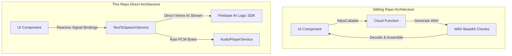

# ADR 0004: Phased Reactive UI Porting & Client-Direct Service Integration

## Status

Proposed

## Context

To build a highly reactive, OnPush/Zoneless-compliant Angular user interface for image analysis and text-to-speech features, we are porting existing visual components from our companion repository, `firebase-ai-hybrid-demo`.

While the sibling repository's components already implement reactive Signal Forms and localized component-level states, they rely on a remote network boundary: calling a Firebase Cloud Function via `httpsCallable`. In this repository, we bypass the Cloud Function entirely, utilizing the client-side **Firebase AI Logic SDK** and direct Web Audio PCM decoding.

This represents a breaking structural change for the ported components. We need to document how this boundary is redesigned and how the components integrate with our local services.

---

## Decision

We will execute the UI porting using a **Phased Porting Strategy** and a **Client-Direct Service Integration** pattern. This eliminates remote network payload parsing from the components and makes the interface incredibly thin, declarative, and easy to manually test.



### 1. Phased Iteration Definition

- **Phase 1: Visual Shell & Mock Presentation**:
  - Port component HTML templates and TypeScript files from the sibling repository.
  - Extract any inline Tailwind CSS utility classes into component-scoped `.css` files using Tailwind v4 `@apply` and `@reference` to enforce strict layout modularity.
  - Bind localized presentation signals and Signal Forms (such as voice selection lists and text inputs).
  - Validate responsive layouts and mock states before connecting live backend services.
- **Phase 2: Client-Direct Service Piping**:
  - Inject `VisionService`, `TextToSpeechService`, and `AudioPlayerService` into the components.
  - Bind the image analyzer file drops to `VisionService` and the voice controls to `TextToSpeechService`.

---

### 2. Client-Direct Service Integration Blueprint (TTS)

Instead of managing asynchronous network streams, base64 decoding, or audio scheduling inside the UI components, all pipeline operations are encapsulated inside `TextToSpeechService`. The components interact with our services via simple, declarative method calls.

#### UI Component Integration Blueprint (`text-to-speech.component.ts`)

```typescript
import { Component, inject, signal } from '@angular/core';
import { TextToSpeechService } from '@/core/services/text-to-speech.service';

@Component({
  selector: 'app-text-to-speech',
  templateUrl: './text-to-speech.component.html',
  styleUrls: ['./text-to-speech.component.css'],
})
export class TextToSpeechComponent {
  readonly #ttsService = inject(TextToSpeechService);

  // Localized form and control signals
  readonly textInput = signal<string>('The blue sunsets of Mars are beautiful.');
  readonly selectedVoice = signal<string>('Kore');

  // Localized UI presentation states
  readonly isSpeaking = signal<boolean>(false);
  readonly errorMessage = signal<string | null>(null);

  /**
   * USE CASE 3: Zero-Latency Interactive Playback
   */
  async speak(): Promise<void> {
    const text = this.textInput().trim();
    if (!text) {
      return;
    }

    this.isSpeaking.set(true);
    this.errorMessage.set(null);

    try {
      // The component simply invokes the service.
      // AudioPlayerService scheduling and direct model streaming are completely hidden.
      await this.#ttsService.speak(text, this.selectedVoice());
    } catch (error: any) {
      this.errorMessage.set(error?.message || 'Failed to synthesize speech.');
    } finally {
      this.isSpeaking.set(false);
    }
  }

  /**
   * USE CASE 1: Ad-hoc Single-shot Download (Optional)
   * Fetches the entire audio and returns a playable Object URL for standard audio controls.
   */
  readonly audioUrl = signal<string | null>(null);

  async downloadAudio(): Promise<void> {
    this.errorMessage.set(null);
    try {
      const url = await this.#ttsService.synthesize(this.textInput(), this.selectedVoice());
      this.audioUrl.set(url);
    } catch (error: any) {
      this.errorMessage.set(error?.message || 'Failed to download audio.');
    }
  }
}
```

---

### 3. Scoped Tailwind CSS v4 Layouts

Any inline styling found in the sibling templates will be moved into local component CSS stylesheets. This keeps the HTML templates highly readable.

**Example Component Scoped Stylesheet (`text-to-speech.component.css`)**:

```css
@reference "../../../../styles.css";

.tts-container {
  @apply flex flex-col gap-4 rounded-xl border border-border bg-card p-6 shadow-sm;
}

.tts-button {
  @apply flex items-center justify-center gap-2 rounded-lg bg-primary px-4 py-2 font-medium text-primary-foreground transition-colors hover:bg-primary/90 disabled:opacity-50;
}
```

---

## Consequences

- **Pros**:
  - **Drastic Code Reduction**: Eliminates complex binary parsing, base64 array-buffer stitching, and HTTP state-handling code from the UI components.
  - **Isolated Testing**: Phase 1 allows developers to test the responsive user experience, dropdowns, and button loading animations without waiting for Vertex AI API responses or local speaker outputs.
  - **Modularity**: Changes to the generative AI models, speech configurations, or safety thresholds in `TextToSpeechService` will have zero impact on the UI layout or code.
- **Cons**:
  - We must refactor any HTTP-related code from the sibling repository templates during porting, which represents a minor translation step.
