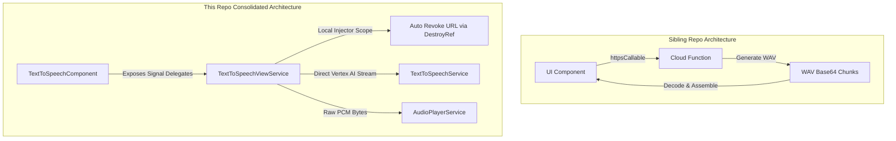

# ADR 0004: Phased Reactive UI Porting & Component-Scoped View Service Integration

## Status

Accepted

## Context

To build a highly reactive, OnPush/Zoneless-compliant Angular user interface for image analysis and text-to-speech features, we are porting existing visual components from our companion repository, `firebase-ai-hybrid-demo`.

While the sibling repository's components already implement reactive Signal Forms and localized component-level states, they rely on a remote network boundary calling a Firebase Cloud Function. In this repository, we bypass the Cloud Function entirely, utilizing the client-side **Firebase AI Logic SDK** and direct Web Audio PCM decoding.

To support multi-modal speech playback—such as single-shot sync, hybrid stream-and-stitch, and zero-latency Web Audio API speaker streaming—managing asynchronous generators, buffer-feeding, error boundaries, and Object URL cleanups directly in the UI component caused it to balloon in size (130+ lines) and violate the Single Responsibility Principle.

We need a clean presentational pattern to decouple the UI layout from the complex asynchronous stateful orchestrations.

---

## Decision

We will execute the UI porting using a **Phased Porting Strategy** and a **Component-Scoped View Service Integration** pattern. This keeps core services stateless, cleans up component layouts, and encapsulates streaming logic behind extremely deep interfaces.



### 1. Phased Iteration Definition

- **Phase 1: Visual Shell & Mock Presentation**:
  - Port component HTML templates and Tailwind CSS v4 stylesheets.
  - Extract inline utility classes into scoped component `.css` stylesheets using `@apply` and `@reference` pointing to the global stylesheet.
- **Phase 2: View Service Orchestration**:
  - Encapsulate all stateful signals, streaming loops, error boundaries, and player coordination inside a dedicated, component-scoped `TextToSpeechViewService` provided locally.
  - The UI component becomes a thin presenter shell, delegating calls directly to this local service.

---

### 2. Component-Scoped View Service Blueprint (`text-to-speech-view.ts`)

Registered inside the component's `providers: [TextToSpeechViewService]` array. It handles state, generator loops, and self-cleans its Object URLs using the native `DestroyRef` constructor token:

```typescript
import { inject, Injectable, DestroyRef, signal, computed } from '@angular/core';
import { TextToSpeechService } from '@/core/services/text-to-speech.service';
import { AudioPlayerService } from '@/core/services/audio-player.service';
import { revokeBlobURL } from '@/core/utils/blob.util';
import { GenerateSpeechMode } from '@/features/dashboard/types/generate-speech-mode.type';
import { FactConfig } from '@/features/dashboard/interfaces/fact-config.interface';

@Injectable()
export class TextToSpeechViewService {
  private readonly speechService = inject(TextToSpeechService);
  private readonly audioPlayerService = inject(AudioPlayerService);
  private readonly destroyRef$ = inject(DestroyRef);

  readonly #audioUrl = signal<string | undefined>(undefined);
  readonly #loadingMode = signal<GenerateSpeechMode | 'idle'>('idle');

  readonly audioUrl = this.#audioUrl.asReadonly();
  readonly loadingRate = this.#loadingMode.asReadonly();
  readonly playbackRate = this.audioPlayerService.playbackRate;

  constructor() {
    // Self-cleaning hook runs automatically when the component injector is destroyed!
    this.destroyRef$.onDestroy(() => {
      revokeBlobURL(this.#audioUrl());
    });
  }

  async generateSpeech(mode: GenerateSpeechMode, promptArgs: FactConfig): Promise<void> {
    if (!promptArgs.fact) return;

    // Flush previous resource
    revokeBlobURL(this.#audioUrl());
    this.#audioUrl.set(undefined);

    try {
      this.#loadingMode.set(mode);
      switch (mode) {
        case 'sync':
          await this.handleSync(promptArgs);
          break;
        case 'stream':
          await this.handleStream(promptArgs);
          break;
        case 'web_audio_api':
          await this.handleWebAudio(promptArgs);
          break;
      }
    } catch (e) {
      console.error('TTS Generation failed:', e);
      throw new Error(
        mode === 'web_audio_api'
          ? 'Error streaming speech using the Web Audio API.'
          : `Error generating speech (${mode === 'stream' ? 'Stream' : 'Sync'}).`,
        { cause: e },
      );
    } finally {
      this.#loadingMode.set('idle');
    }
  }

  private async handleSync(promptArgs: FactConfig) {
    let createdUrl: string | undefined = undefined;
    try {
      const blob = await this.speechService.synthesize(promptArgs.prompt, promptArgs.voice);
      if (blob) {
        createdUrl = URL.createObjectURL(blob);
        this.#audioUrl.set(createdUrl);
      }
    } catch (e) {
      this.handlePlaybackError(e, createdUrl);
      throw e;
    }
  }

  private async handleStream(promptArgs: FactConfig) {
    let createdUrl: string | undefined = undefined;
    let finalBlob: Blob | undefined = undefined;
    let isInitialized = false;
    try {
      for await (const chunk of this.speechService.synthesizeStream(
        promptArgs.prompt,
        promptArgs.voice,
      )) {
        if (chunk instanceof Blob) {
          finalBlob = chunk;
        } else {
          isInitialized = this.processStreamChunk(isInitialized, chunk);
        }
      }
      await this.audioPlayerService.awaitPlaybackComplete();
      if (finalBlob) {
        createdUrl = URL.createObjectURL(finalBlob);
        this.#audioUrl.set(createdUrl);
      }
    } catch (e) {
      this.handlePlaybackError(e, createdUrl);
      throw e;
    }
  }

  private async handleWebAudio(promptArgs: FactConfig) {
    let isInitialized = false;
    try {
      for await (const chunk of this.speechService.speak(promptArgs.prompt, promptArgs.voice)) {
        isInitialized = this.processStreamChunk(isInitialized, chunk);
      }
    } catch (e) {
      this.handlePlaybackError(e, '');
      throw e;
    }
  }

  private processStreamChunk(
    isInitialized: boolean,
    chunk: { decodedData: Uint8Array; sampleRate: number },
  ) {
    if (!isInitialized) {
      this.audioPlayerService.initialize(chunk.sampleRate);
      isInitialized = true;
    }
    this.audioPlayerService.processChunk(chunk.decodedData);
    return isInitialized;
  }

  private handlePlaybackError(e: unknown, createdUrl: string | undefined) {
    console.error('Playback exception:', e);
    this.audioPlayerService.stopAll();
    revokeBlobURL(createdUrl);
  }
}
```

---

### 3. Simplified Presenter Blueprint (`text-to-speech.component.ts`)

The component is highly-leveraged and declarative, acting as a clean wrapper around the view service signals so the template bindings remain completely unchanged:

```typescript
import { Component, inject, input, model, computed } from '@angular/core';
import { GenerateSpeechMode } from '@/features/dashboard/types/generate-speech-mode.type';
import { TextToSpeechViewService } from './services/text-to-speech-view';

@Component({
  selector: 'app-text-to-speech',
  templateUrl: './text-to-speech.component.html',
  styleUrl: './text-to-speech.component.css',
  providers: [TextToSpeechViewService], // Scoped local provider
})
export class TextToSpeechComponent {
  private readonly viewService = inject(TextToSpeechViewService);

  interestingFact = input<string | undefined>(undefined);
  audioPrompt = input.required<string>();
  voice = input.required<string>();

  ttsError = model<string>('');

  // Expose signals as simple delegates so the HTML template remains untouched!
  audioUrl = this.viewService.audioUrl;
  playbackRate = this.viewService.playbackRate;
  loadingMode = this.viewService.loadingRate;
  isLoading = computed(() => this.loadingMode() !== 'idle');

  async generateSpeech(mode: GenerateSpeechMode) {
    try {
      const fact = this.interestingFact();
      if (!fact) return;

      await this.viewService.generateSpeech(mode, {
        prompt: this.audioPrompt(),
        voice: this.voice(),
        fact,
      });
    } catch (e) {
      const errorMessage = e instanceof Error ? e.message : 'Error generating speech.';
      this.ttsError.set(errorMessage);
    }
  }
}
```

---

## Consequences

- **Pros**:
  - **Drastic Component Complexity Reduction**: Eliminates generator loops, manual player orchestrations, and lifecycle logic from the visual template controller.
  - **Bulletproof Memory Safety**: Utilizing `DestroyRef` inside the localized service constructor guarantees all transient memory (Object URLs) is automatically disposed of on destruction.
  - **Isolated Testing (Strict Seams)**: The component can be tested using mock view service overrides. The orchestration logic can be tested in isolation inside the service's own spec file.
- **Cons**:
  - Increases total file counts slightly by introducing the view-specific service helper class.
