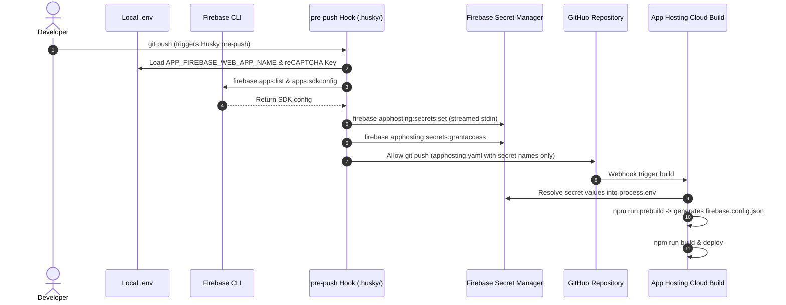

# 0007: Firebase App Hosting Secret Management and Zero-Credential Git Strategy

- **Status**: Accepted
- **Date**: 2026-09-04 (Updated 2026-09-10)

## Context

When deploying applications using **Firebase App Hosting** with continuous GitHub integration, build containers dynamically compile frontend runtime assets (specifically `public/firebase.config.json`) during the `prebuild` phase. This compilation requires active Firebase credentials (API Key, Project ID, App ID, Storage Bucket, Messaging Sender ID, Auth Domain) and the reCAPTCHA Enterprise Site Key.

However, handling these credentials presents three distinct challenges:

1. **Repository Security & Scanner Alerts**: Committing raw Google API keys (`AIzaSy...`) or reCAPTCHA credentials directly into `apphosting.yaml` or tracked Git files triggers automated GitHub secret scanning alerts, fails enterprise compliance audits, and exposes project identifiers to public scrapers.
2. **Cloud Infrastructure Overhead**: Navigating the Google Cloud Platform (GCP) Console to manually create secrets in Secret Manager, configure replication policies, and assign `Secret Manager Secret Accessor` IAM permissions to Cloud Build and App Hosting service accounts is complex, error-prone, and slow.
3. **Web Console Friction & Configuration Redundancy**: Manually copying and pasting 6 separate SDK environment variables into local `.env` files and the Firebase Web Console creates configuration drift and increases the risk of human error.

## Decision

We will implement a **Zero-Credential Git Strategy** combined with **Automated CLI Web App Discovery & Secret Provisioning** and a **Git `pre-push` gatekeeper hook** to securely bridge local configuration to Firebase App Hosting:

### 1. Declarative Secret References in `apphosting.yaml`

`apphosting.yaml` will only declare variable-to-secret _name references_ (e.g., `secret: firebase_api_key`), containing zero literal keys, credentials, or sensitive strings. Variable names use the `APP_FIREBASE_*` prefix to comply with Firebase App Hosting schema restrictions that reserve system prefixes (`FIREBASE_`, `X_GOOGLE_`, `EXT_`, `KIT_`):

```yaml
runConfig:
  minInstances: 0
  maxInstances: 2

env:
  - variable: APP_FIREBASE_API_KEY
    secret: firebase_api_key
  - variable: APP_FIREBASE_AUTH_DOMAIN
    secret: firebase_auth_domain
  - variable: APP_FIREBASE_PROJECT_ID
    secret: firebase_project_id
  - variable: APP_FIREBASE_STORAGE_BUCKET
    secret: firebase_storage_bucket
  - variable: APP_FIREBASE_MESSAGING_SENDER_ID
    secret: firebase_messaging_sender_id
  - variable: APP_FIREBASE_APP_ID
    secret: firebase_app_id
  - variable: APP_FIREBASE_RECAPTCHA_ENTERPRISE_KEY
    secret: firebase_recaptcha_enterprise_key
```

### 2. Streamlined Local `.env` & Dynamic CLI SDK Discovery

Developers only maintain the Web App display name (`APP_FIREBASE_WEB_APP_NAME`), `APP_FIREBASE_RECAPTCHA_ENTERPRISE_KEY`, and optional `APP_FIREBASE_APPCHECK_DEBUG_TOKEN` in `firebase/.env`.

Both config generation and cloud secrets deployment dynamically query the Firebase CLI:

- Run `firebase apps:list WEB --json --project default` to find the target web app's `appId` by display name.
- Run `firebase apps:sdkconfig WEB <appId> --json --project default` to fetch the authoritative SDK properties directly from Google Cloud.

### 3. Fail-Fast Local Environment Validation

To prevent corrupt or empty strings from being provisioned or compiled, automation scripts validate required environment variables upfront. If any variable is missing, blank, or contains placeholder characters (e.g., `<...>`):

- The process immediately logs a descriptive error identifying the exact issue.
- Execution halts instantly with exit code `1`, preventing accidental deployment or broken builds.

### 4. Automated CLI Secret Provisioning (`firebase/scripts/deploy-apphosting-secrets.mjs`)

A dedicated Node.js automation script (`npm run config:secrets`) handles cloud provisioning directly from the developer's terminal:

- Dynamically resolves SDK values via the Firebase CLI using `APP_FIREBASE_WEB_APP_NAME`.
- Streams secret values securely into Firebase Cloud via `npx firebase apphosting:secrets:set <secretName> --data-file - --force` without interactive prompts.
- Grants read permissions to the backend compute service account via `npx firebase apphosting:secrets:grantaccess <secrets> -b ng-firebase-tts`.

### 5. Git `pre-push` Gatekeeper Hook (`.husky/pre-push`)

To completely eliminate human error (forgetting to sync changed keys), we use a Git `pre-push` Husky hook.

- Every time `git push` is executed, Husky runs `npm run test:once && npm run config:secrets` on the developer's machine first.
- If the local keys are valid and successfully synced to the cloud safe, the git push is allowed to proceed to GitHub.
- If there is a typo or missing value, the hook aborts the git push instantly, protecting the build pipeline from running with broken or empty secrets.

### 6. Build-Time Container Injection

During automated GitHub push triggers:

- Firebase App Hosting resolves the referenced secrets and securely injects them into the Cloud Build container's `process.env`.
- During build, App Hosting provides the injected values directly into the build pipeline.



## Consequences

### Positive

- **100% Zero Secrets in Git**: No API keys, credentials, or reCAPTCHA tokens exist in the repository, completely eliminating GitHub security scanner alerts.
- **Zero Redundant SDK Config**: Developers never need to manually copy 6 individual SDK keys into `.env` files; the CLI dynamically resolves the correct values from the Web App name.
- **Zero Web Console Overhead**: Developers never need to open the GCP Console or manually type environment variables into the Firebase Web Console UI.
- **Human-Error Prevention**: Git blocks the push if you have typos or missing configuration keys locally, keeping deployment configuration completely secure and working.

### Negative / Trade-offs

- Running `git push` takes an additional 5-10 seconds on the client machine to complete the cloud secrets synchronization process.
