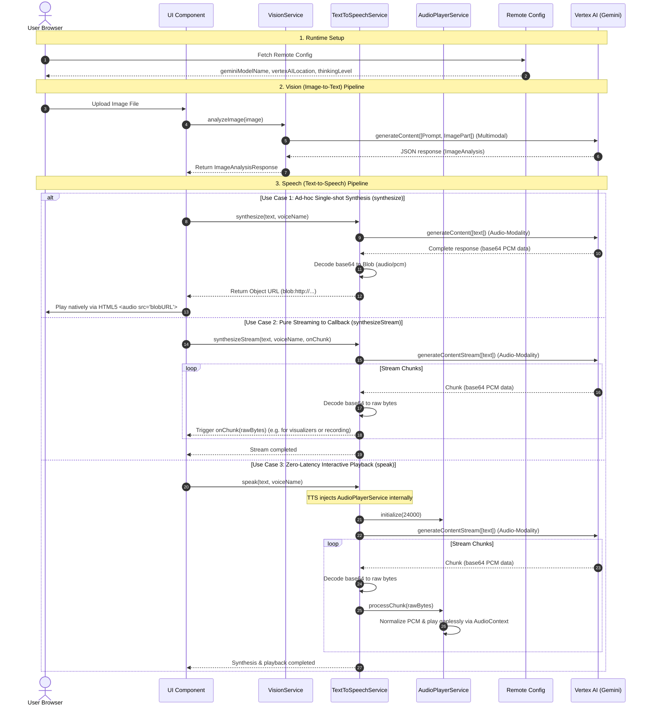

# System Architecture: Client-Side Audio & Vision Pipelines

This document provides a technical design overview of how `ng-firebase-tts` implements client-side generative AI and real-time Text-to-Speech (TTS) synthesis natively in the browser without server-side compute.

---

## High-Level Pipeline Architecture

The application is split into two distinct, decoupled pipelines: **Vision (Image Analysis)** and **Speech (Voice Synthesis)**. They communicate via stateless data payloads across clean architectural seams.

---

## Architectural Responsibility Breakdown

### 1. Vision Pipeline (`VisionService`)

- **Role**: Handles multimodal parsing of local browser binary files into Generative Parts.
- **Interface**: Small, focused signature taking a native `File` object and returning structured, typed JSON data.
- **Decoupling**: Independent of speech generation; its outputs are raw JSON facts that can be fed into any downstream consumer.

### 2. Synthesis Pipeline (`TextToSpeechService`)

- **Role**: Orchestrates the communication with Vertex AI for Firebase using the dynamic, regional `AgentPlatformBackend`. It manages dynamic, on-the-fly model creation based on user voice presets.
- **Dependency Injection**: Injects the low-level `AudioPlayerService` directly to handle Use Case 3 (Zero-latency playback) autonomously.
- **Trio of Supported Operations**:
  - **Use Case 1 (Ad-hoc)**: `synthesize(text, voiceName)`: Returns a standard Blob Object URL.
  - **Use Case 2 (Pure Streaming)**: `synthesizeStream(text, voiceName, onChunk)`: Feeds raw decoded bytes to a caller's custom callback (perfect for visualizers).
  - **Use Case 3 (Immediate Playback)**: `speak(text, voiceName)`: Direct piping to the injected `AudioPlayerService` for immediate speaker output, reducing waiting latency to near-zero.

### 3. Playback Pipeline (`AudioPlayerService`)

- **Role**: Manages browser-level Web Audio API contexts.
- **Zero-Header Processing**: Completely bypasses complex, server-side WAV header assembly. Converts raw, headerless mono 16-bit PCM streams into standard Float32 audio samples.
- **Gapless Scheduling**: Chronologically queues sequential audio buffers using precise `AudioContext.currentTime` scheduling, preventing any clicking, popping, or playback delay.
